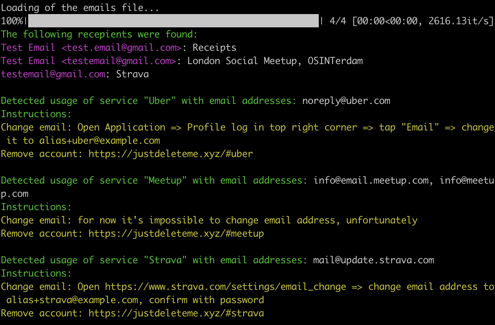

# Mailto analyzer

Curious about how to start to improve your OPSEC for your email account, but don’t know where to start?
**Analyze your emails!** Mailto analyzer will show your email address exposure on various services.

## Abstract

Mailto analyzer is a proof of concept tool, extracting from exported emails fields "To": your names and email addresses. The trick is that
you could be registered in some services or saved in contact books with the different names or even with different email addresses!

According to [RFC522](https://datatracker.ietf.org/doc/html/rfc5233), it's possible to use notation `alias+subaddress@example.com` for subaddressing, so every service should accept such email as unique, but all correspondence will be routed to your default mailbox anyway. Google also [supports additional dots](https://support.google.com/mail/answer/7436150) in email address, thus increasing amount of possible variations of your email.

Such tools as [holehe](https://github.com/megadose/holehe) could help you to check externally if you registered in some services (and reveal some your info), but the ideal coverage you'll get if check all emails received from services: registration confimations, notifications, even spam!

Knowing in which service you are registered, with which name and with which email address (e.g. with a default one), you can decide to update your personal data there or change the email, **complicating the search for your accounts** using tools like holehe.

This tool will provide you some tips based on found services: how to quickly change email address or remove such accounts completely.

## Usage

Export or download your inbox emails ([Google example](https://www.indeed.com/career-advice/career-development/download-emails-from-gmail)), only MBOX format is currently supported.

`./analyze.py example.mbox`

